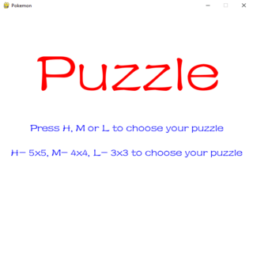

# Pygame - Pokemon puzzle
A simple game pokemon puzzle in pygame

## Instructions
- Execute the game
- Choice the size of the game:
  * S = 3x3 size
  * M = 4x4 size
  * L = 5x5 size
- Have fun!
- To play again in the final screen, press ENTER.

### Image
 

